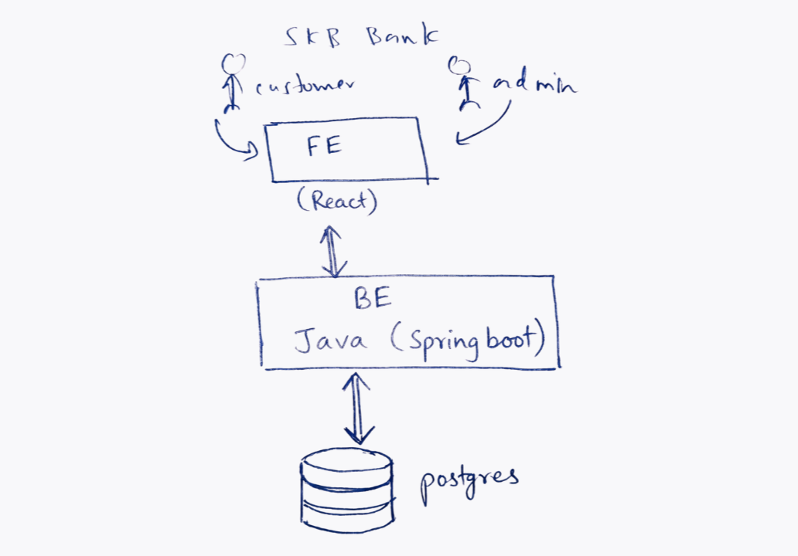

# SKB Bank


A modern full-stack banking application built with React, Spring Boot, PostgreSQL, Docker, and JWT Authentication.

---

## Overview



---

## Features

### Authentication

- User Registration
- User Login
- JWT Authentication
- Role-based Authorization
- Admin & Customer Portals

### Customer

- Dashboard
- Profile
- Bank Accounts
- Deposit Money
- Withdraw Money
- Transfer Money
- Transaction History

### Admin

- Dashboard
- Manage Users
- Manage Accounts
- View Transactions
- Reports

---

## Tech Stack

### Frontend

- React
- TypeScript
- Vite
- Tailwind CSS
- React Router
- Axios
- React Hook Form
- Zod

### Backend

- Spring Boot
- Spring Security
- JWT
- Hibernate
- JPA
- PostgreSQL
- Maven

### DevOps

- Docker
- Docker Compose

---

## 📂 Project Structure

```text
skb-bank/

├── frontend/
├── backend/
├── docs/
└── docker-compose.yml
```

---

## Getting Started

### Clone

```bash
git clone https://github.com/savidyakolonne/skb-bank.git
```

### Backend

```bash
cd backend
./mvnw spring-boot:run
```

### Frontend

```bash
cd frontend
npm install
npm run dev
```

---

## 🌐 Case Study

Read the complete case study, architecture, development process, and design decisions here:

### 👉 **https://savidyakolonne.me/work/skbbank**

---

## 📄 License

This project is developed for learning, portfolio, and demonstration purposes.